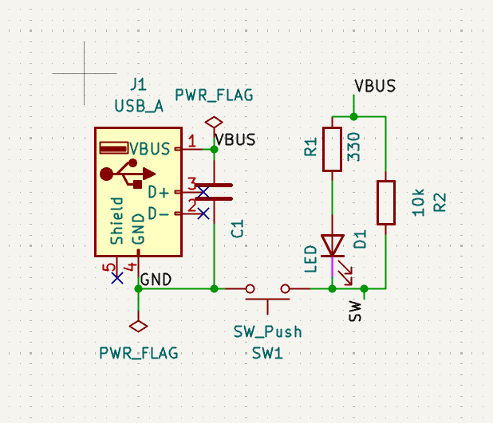
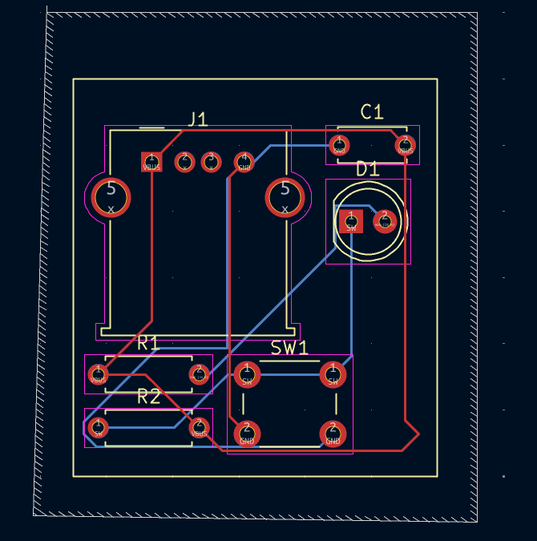
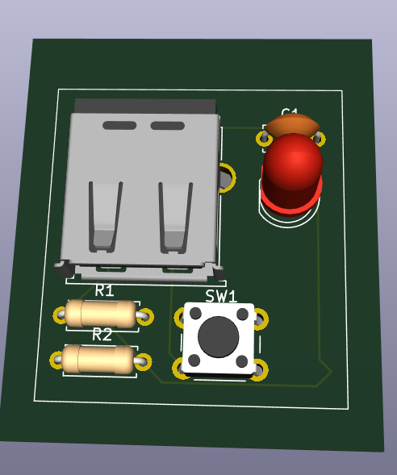
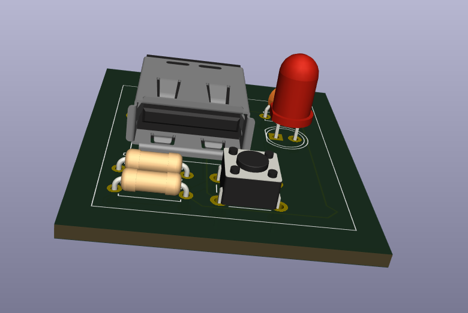

# USB Powered LED Controller Board

A beginner-friendly KiCAD EDA project: a small through-hole PCB that powers and controls a single LED from USB 5V using a tactile push button. No microcontroller or firmware required — this project teaches the full PCB design workflow (schematic capture, ERC, footprint assignment, layout, 3D validation, and manufacturing output).

Designed by Jenna – Embedded Enthusiast

---

## Key Features

- Powers a single LED from USB-A VBUS (5V)
- Push-button control (press to light)
- Current-limited to ~8–10 mA using a 330 Ω resistor
- 10 kΩ pull-up to keep the LED node defined when switch is open
- 0.1 µF decoupling capacitor on VBUS
- Through-hole components (THT) for easy soldering
- Board size: 40 mm × 20 mm

---

## Operation Summary (Truth Table)

| Switch State | Cathode Node | LED     |
|--------------|--------------|---------|
| Released     | HIGH (5V)    | OFF     |
| Pressed      | LOW (GND)    | ON      |

---

## Components (Reference)

- J1 — USB-A Connector — Connector_USB:USB_A_Horizontal
- D1 — 5 mm LED — LED_THT:LED_D5.0mm
- R1 — 330 Ω — Resistor_THT:R_Axial_DIN0207_P7.62mm
- R2 — 10 kΩ — Resistor_THT:R_Axial_DIN0207_P7.62mm
- SW1 — Tactile Switch 6×6 — Button_Switch_THT:SW_PUSH_6mm
- C1 — 0.1 µF Ceramic — Capacitor_THT:C_Disc_D5.0mm_P2.5mm

---

## Design Rationale (short)

- R1 = 330 Ω gives I ≈ (5V − 2V) / 330 ≈ 9 mA — safe for USB and visible brightness.
- R2 = 10 kΩ keeps the cathode node from floating when the switch is open.
- C1 = 0.1 µF decouples USB VBUS to avoid flicker and suppress noise.
- PWR_FLAG symbols added in schematic to satisfy ERC for power nets.

---

## PCB Design Rules (used)

- Clearance: 0.3 mm
- Power track width: 1.0 mm
- Signal track width: 0.6 mm
- Via drill (if used): 0.6 mm
- Silk clearance: 0.2 mm
- Copper fill tied to GND

---

## Assembly & Bring-Up

1. Solder all through-hole parts (D1, R1, R2, C1, SW1, J1).
2. Inspect soldering and check no shorts on VBUS/GND.
3. Plug in USB cable (5V should appear on VBUS).
4. Press SW1 — D1 should light.
5. Measure:
   - VBUS to GND = ~5.0 V
   - LED current ≈ 8–10 mA (verify with ammeter in series)

Safety note: if LED is unusually bright or current > 20 mA, unplug and re-check R1 value and orientation.

---

## Files in This Project

- schematic.kicad_sch — project schematic
- board.kicad_pcb — PCB layout
- footprints/ — folder with custom footprint assignments (if any)
- fab/ — exported Gerbers & Excellon files
- bom.csv — bill of materials (CSV)
- images/ — example images used below (replace placeholders with your own photos/exports)

---

## Images

Replace the files in `images/` with your exported PNG/JPG files from KiCAD or photos of the assembled board. The README references these four example images:

Figure: Project schematic (exported from KiCAD schematic editor)

Figure: PCB top view showing component placement and routing

Figure: 3D model view from KiCAD 3D viewer (verify part clearances & orientation)

Figure: Photo of the assembled board (optional — useful for documentation)

Tip: export the schematic and PCB views at 300–600 DPI for clear README images; use a 3:2 or 4:3 aspect ratio for nicer layout on README pages.

---

## Generating Manufacturing Outputs

From KiCAD PCB editor:
- File → Fabrication Outputs → Plot → Generate Gerber (Top/Bottom, Silks, Soldermask, etc.)
- File → Fabrication Outputs → Drill Files → Generate Excellon Drill
- Tools → BOM → Generate CSV (or use a plugin for extended BOM)
- Run final DRC and 3D inspection before submission to manufacturer

---

## Notes & Learning Outcomes

This project is ideal for learning:
- KiCAD schematic capture and layout flow
- ERC and DRC workflows
- Footprint matching and pad spacing for THT parts
- Generating fabrication outputs and BOM
- Basic analog reasoning for LED current limiting and pull-ups

---

## License & Credits

- Designed by Jenna – Embedded Enthusiast
- Feel free to reuse and adapt for educational purposes. If you publish derivatives, please credit the original author.

---
